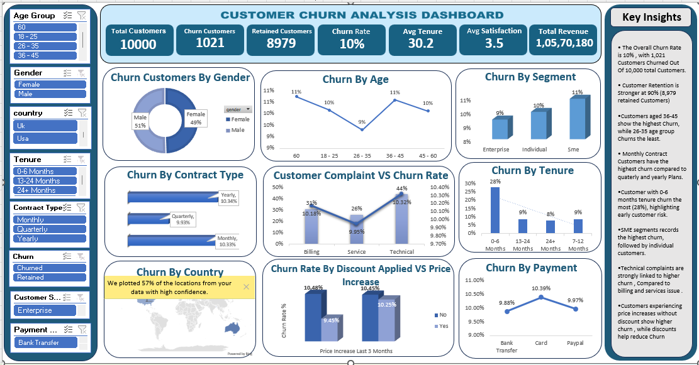

# Customer Churn Analysis Dashboard

## Project Overview

This project presents an interactive **Customer Churn Analysis Dashboard** built in Microsoft Excel to analyze customer retention, churn behavior, customer demographics, contract types, complaints, payment methods, and revenue impact.

The dashboard helps businesses identify the key factors driving customer churn and supports data-driven retention strategies through comprehensive customer analytics and interactive visualizations.

## Objectives

- Monitor customer churn and retention performance.
- Identify high-risk customer segments.
- Analyze churn patterns across age groups, gender, tenure, and contract types.
- Evaluate the impact of complaints, pricing changes, discounts, and payment methods on churn.
- Support customer retention and engagement strategies.

## Dashboard Preview

## Key Performance Indicators (KPIs)

| KPI | Value |
|------|--------|
| Total Customers | 10,000 |
| Churn Customers | 1,021 |
| Retained Customers | 8,979 |
| Churn Rate | 10% |
| Average Tenure | 30.2 |
| Average Satisfaction Score | 3.5 |
| Total Revenue | 10,570,180 |

## Dashboard Features

### Customer Churn by Gender
Analyzes churn distribution between male and female customers.

### Churn by Age Group
Examines customer churn across different age categories.

### Churn by Customer Segment
Compares churn rates among Enterprise, Individual, and SME customers.

### Churn by Contract Type
Evaluates churn behavior across monthly, quarterly, and yearly contracts.

### Customer Complaints vs Churn Rate
Measures the relationship between customer complaints and customer churn.

### Churn by Tenure
Analyzes customer churn across different tenure groups.

### Churn by Country
Visualizes churn distribution across customer locations.

### Churn Rate by Discount Applied vs Price Increase
Assesses whether discounts help reduce churn after price increases.

### Churn by Payment Method
Compares churn rates across different payment channels.

### Interactive Filters
Users can dynamically filter the dashboard by:
- Age Group
- Gender
- Country
- Tenure
- Contract Type
- Churn Status
- Customer Segment
- Payment Method

## Key Insights

- The overall churn rate is **10%**, with **1,021 customers lost** out of **10,000 customers**.
- Customers aged **36–45** show the highest churn rate, making them a key retention focus group.
- **SME customers** experience higher churn compared to Enterprise and Individual customers.
- Customers with **0–6 months tenure** are more likely to churn, highlighting onboarding and early engagement challenges.
- **Monthly contract customers** exhibit higher churn rates than customers on longer-term contracts.
- **Technical complaints** are more strongly associated with churn than billing or service-related issues.
- Customers facing **price increases without discounts** show higher churn rates, while discounts appear to improve retention.
- Payment methods show minor variations in churn, with card payments exhibiting slightly higher churn rates.

## Business Value

This dashboard helps organizations:

- Identify customers at risk of leaving.
- Improve customer retention strategies.
- Reduce revenue loss caused by churn.
- Optimize contract and pricing policies.
- Enhance customer experience through complaint analysis.
- Improve customer lifetime value (CLV).

## Tools Used

- Microsoft Excel
- Pivot Tables
- Pivot Charts
- Slicers
- Conditional Formatting
- Dashboard Design

## Author

**Ruchi**
